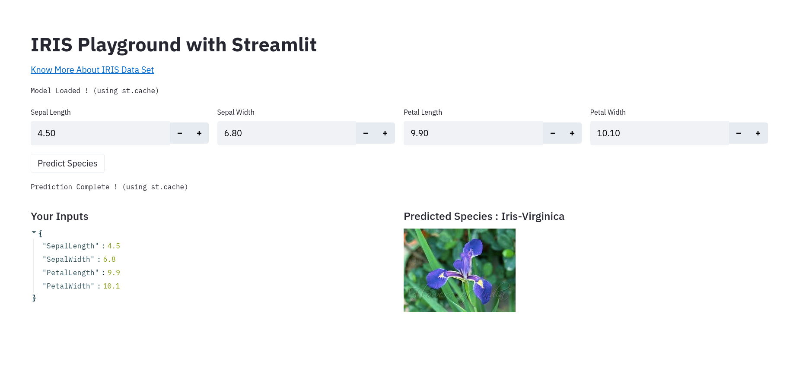

# This Repository demonstrates use of Streamlit with the classic IRIS Playground

## I have another repository that shows the plain old Docker based ML Deployment

### If you are interested please visit [here](https://github.com/rajeshr6r/irisplayground)

> You can do that by simply pulling the docker image with the following command and then running it as follows

~~~
docker pull rajeshr6routlook/irisplaygroundstreamlit:latest

docker run -itd -p 8501:8501 rajeshr6routlook/irisplaygroundstreamlit:latest
~~~

### Screenshot of the Streamlit app

